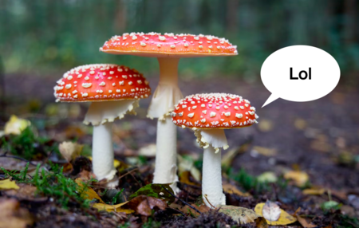

# Mushroom Classification

Este repositorio contiene un script de Python para clasificar hongos comestibles y venenosos utilizando un algoritmo de Random Forest. El script utiliza el conjunto de datos ["mushrooms.csv"](mushrooms.csv) para entrenar y evaluar el clasificador.



## Requisitos

Asegúrate de tener instaladas las siguientes dependencias antes de ejecutar el script:

- Python 3
- pandas
- matplotlib
- scikit-learn

Puedes instalar las dependencias con el siguiente comando:

```python
pip install -r requirements.txt
```

## Uso

Sigue los pasos a continuación para ejecutar el script:

1. Descarga el conjunto de datos ["mushrooms.csv"](mushrooms.csv) y colócalo en el mismo directorio que el script.

2. Ejecuta el script ["Class_Mushrooms.py"](Class_Mushrooms.py) usando el siguiente comando:

```python
python mushroom_classification.py
```

El script realizará las siguientes tareas:

1. Cargar el conjunto de datos ["mushrooms.csv"](mushrooms.csv) como un DataFrame de Pandas.

2. Convertir las columnas categóricas en números utilizando la función `get_dummies` de Pandas.

3. Separar el conjunto de datos en datos de entrenamiento y de prueba utilizando la función `train_test_split` de scikit-learn.

4. Entrenar un clasificador Random Forest utilizando la clase `RandomForestClassifier` de scikit-learn.

5. Hacer predicciones en los datos de prueba y calcular la precisión de las predicciones utilizando la función `accuracy_score` de scikit-learn.

6. Calcular y visualizar la matriz de confusión utilizando la función `confusion_matrix` de scikit-learn y la librería `matplotlib`.

## Resultados

El script imprimirá la precisión del clasificador en los datos de prueba y mostrará una representación visual de la matriz de confusión.

¡Y eso es todo! Ahora puedes ejecutar el script y explorar la clasificación de hongos comestibles y venenosos utilizando el algoritmo Random Forest.

Si tienes alguna pregunta o inquietud, no dudes en abrir un problema o enviar una solicitud de extracción. ¡Disfruta clasificando hongos!
